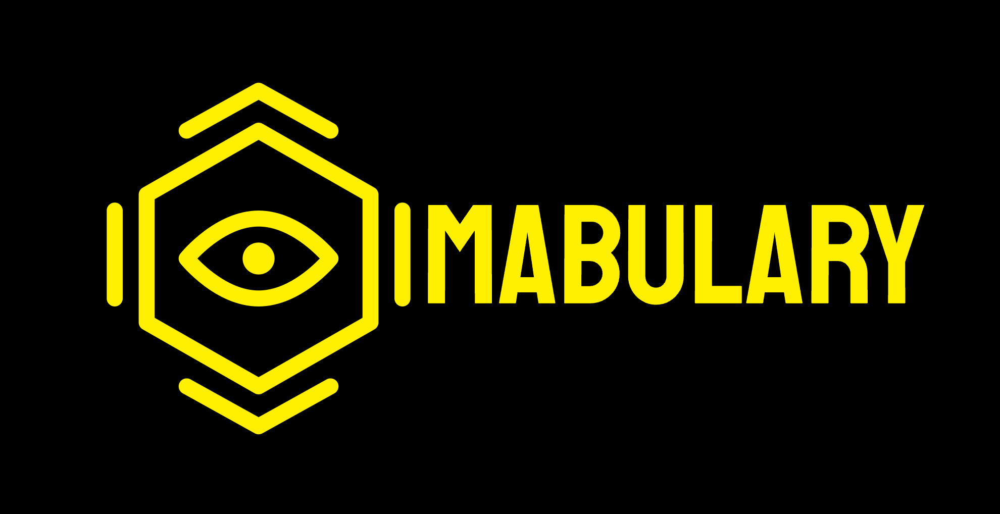

<h1 align="center">
  
</h1>

<h3>
  Imabulary - your brain will remember!
</h3>

Contents

- [About](#about)
- [Built With](#built-with)
  - [Mobile client](#mobile-client)
  - [Backend](#backend)
  - [Infrastructure](#infrastructure)
- [Usage](#usage)
  - [Start a local development](#start-a-local-development)
- [Project structure](#project-structure)
- [Contributing](#contributing)
- [License](#license)

## About

Imabulary helps to develop a long-term memory when it comes to learning new words and phrases in a foreign language. It allows users to take a picture or choose one from gallery and the tool will provide an instant description and translation of the item on the picture in your target language.

## Built With

### Mobile client

- [Dart](https://dart.dev/)
- [Flutter](https://flutter.dev/)

### Backend

- [Node.js](https://nodejs.org/)
- [Nest.js](https://nestjs.com/)
- [PostgreSQL](https://www.postgresql.org/)

### Infrastructure

- [Docker](https://www.docker.com/)
- [Google Cloud Platform](https://cloud.google.com/)

## Usage

### Start a local development

1. Make sure that Docker and `docker-compose` tools are installed on your local device.
2. Create all required `.env` files to start the project. [How to work with `.env` files](docs/SECURITY.md).
3. Populate project's CLI commands by running `source scripts.sh` in the terminal being in the root directory of the project. Yes, you have to have a UNIX-based machine or environment.
4. Run `devBuild` command in the terminal. By doing it, you start a backend and database using Docker, so make sure that Docker daemon is running on your machine.
5. To start a mobile app, you have to have either an emulator running on your device or a real device connected to your machine. Then run `flutter run` in the terminal and choose your prefered device.

## Project structure

- `docs/` - project documentation
- `mobile/` - source code of mobile app
- `server/` - source code of the backend
- `.github/` - GitHub configs

## Contributing

Please see: [CONTRIBUTING.md](docs/CONTRIBUTING.md)

## License

_TBD_
